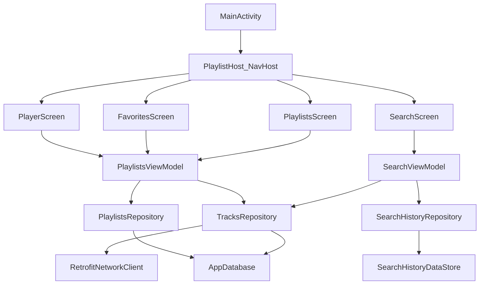

# PROJECT DEFENSE FULL GUIDE

## 1. Цель проекта и функциональность

`PlaylistMaker` — Android-приложение для:
- поиска треков в iTunes,
- сохранения истории запросов,
- добавления треков в избранное,
- создания и ведения плейлистов,
- просмотра карточки трека и добавления трека в плейлист.

Функции по экранам:
- `MainMenu`: переходы в фичи.
- `Search`: поиск + история + retry.
- `Playlists`: список плейлистов.
- `CreatePlaylist`: создание плейлиста с обложкой.
- `PlaylistScreen`: детали плейлиста и треки в нем.
- `Favorites`: избранные треки.
- `Player`: карточка трека, лайк и добавление в плейлист.
- `Settings`: share, support, agreement.

---

## 2. Технологический стек

Источники:
- [`app/build.gradle.kts`](app/build.gradle.kts)
- [`gradle/libs.versions.toml`](gradle/libs.versions.toml)

Основное:
- Kotlin `2.0.21`
- AGP `8.13.2`
- minSdk `29`, target/compileSdk `36`
- JVM target `11`

Библиотеки:
- UI: Jetpack Compose + Material3
- Навигация: `Navigation Compose`
- Сеть: `Retrofit` + `Gson`
- Локальная БД: `Room` (через KSP)
- Легкое локальное хранение: `DataStore Preferences`
- Картинки: `Coil`
- Асинхронность: Coroutines + Flow/StateFlow

---

## 3. Архитектура проекта

## 3.1 Слои
- `ui`: composable-экраны, ViewModel, состояния UI.
- `domain`: интерфейсы репозиториев и interactor.
- `data`: реализации репозиториев, сеть, Room, DataStore, маппинг.

Фактическая модель: MVVM + частичное clean-like разделение по слоям.

## 3.2 DI и composition root
- Зависимости создаются вручную через `Creator`.
- DB/DataStore singleton-объекты выдаются через `StorageProvider`.
- ViewModel фабрики вызывают `Creator` и получают необходимые репозитории.

Ключевые файлы:
- [`Creator.kt`](app/src/main/java/com/practicum/playlistmaker/creator/Creator.kt)
- [`StorageProvider.kt`](app/src/main/java/com/practicum/playlistmaker/data/storage/StorageProvider.kt)

## 3.3 Архитектурная схема

---

## 4. Вход в приложение и навигация

### 4.1 Точка входа
- `MainActivity` создает:
  - `SearchViewModel`
  - `PlaylistsViewModel`
- Затем передает их в `PlaylistHost`.

Файл:
- [`MainActivity.kt`](app/src/main/java/com/practicum/playlistmaker/ui/activity/MainActivity.kt)

### 4.2 Навигация
- Весь граф маршрутов собран в `PlaylistHost`.
- `playlistId` передается как nav argument.
- Текущий трек для player передается через singleton `PlayerNavigationArgs.pendingTrack`.

Файлы:
- [`PlaylistHost.kt`](app/src/main/java/com/practicum/playlistmaker/ui/navigation/PlaylistHost.kt)
- [`PlayerNavigationArgs.kt`](app/src/main/java/com/practicum/playlistmaker/ui/navigation/PlayerNavigationArgs.kt)

Маршруты:
- `main_menu`
- `search`
- `settings`
- `playlists`
- `favorites`
- `create_playlist`
- `playlist_screen/{playlistId}`
- `player`

---

## 5. Разбор экранов и цепочек вызовов

## 5.1 MainMenu
- Файл: `ui/main/MainMenuScreen.kt`
- Назначение: только навигация, без ViewModel.

## 5.2 Search
- UI: `ui/search/SearchScreen.kt`
- VM: `ui/search/SearchViewModel.kt`
- State: `ui/search/SearchState.kt`

Как работает:
1. Пользователь вводит запрос.
2. `SearchViewModel` делает `debounce(1000)` + `distinctUntilChanged()`.
3. Вызывает `tracksRepository.searchTracks(trimmedQuery)`.
4. Параллельно добавляет запрос в историю: `searchHistoryRepository.addToHistory(...)`.
5. Возвращает `SearchState.Success` или `SearchState.Fail`.

Ключевые детали:
- Есть защита от гонок: `searchGeneration`.
- Ошибки обрабатываются как `IOException`.

## 5.3 Playlists (список)
- UI: `ui/playlist/PlaylistsScreen.kt`
- VM: `ui/playlist/PlaylistsViewModel.kt`

Как работает:
- UI подписывается на `playlists: Flow<List<Playlist>>`.
- Данные приходят из `PlaylistsRepository.getAllPlaylists()`.
- FAB открывает `CreatePlaylist`.

## 5.4 CreatePlaylist
- UI: `ui/playlist/CreatePlaylistScreen.kt`
- VM-операция: `PlaylistsViewModel.createNewPlayList(...)`

Как работает:
1. Пользователь выбирает изображение.
2. `PlaylistCoverStorage` копирует файл в internal storage.
3. По Save вызывается `addNewPlaylist` в Room.

## 5.5 PlaylistScreen (детали плейлиста)
- UI: `ui/playlist/PlaylistScreen.kt`
- VM: `ui/playlist/PlaylistViewModel.kt`
- Доп. действия: `PlaylistsViewModel`

Как работает:
- `PlaylistViewModel` получает конкретный плейлист по `playlistId`.
- Треки внутри плейлиста показываются из relation-модели.
- Long press по треку -> удаление связи трек-плейлист.

## 5.6 Favorites
- UI: `ui/favorites/FavoritesScreen.kt`
- VM: `PlaylistsViewModel`

Как работает:
- Подписка на `favoriteList: Flow<List<Track>>`.
- Long press удаляет из избранного через `toggleFavorite(..., false)`.

## 5.7 Player
- UI: `ui/player/PlayerScreen.kt`
- VM: отдельного `PlayerViewModel` нет, используется `PlaylistsViewModel`.

Как работает:
- Берет трек из `PlayerNavigationArgs.pendingTrack`.
- Проверяет наличие трека в БД (`isExist`).
- Лайк/анлайк: `toggleFavorite`.
- Добавление в плейлист: `insertTrackToPlaylist`.

## 5.8 Settings
- UI: `ui/settings/SettingsScreen.kt`
- Используются system intents:
  - share
  - email support
  - open browser
- Переключатель темы сейчас не реализован (toast).

---

## 6. Data layer подробно

## 6.1 Сеть

Ключевые файлы:
- [`ITunesApiService.kt`](app/src/main/java/com/practicum/playlistmaker/data/network/ITunesApiService.kt)
- [`ITunesApiFactory.kt`](app/src/main/java/com/practicum/playlistmaker/data/network/ITunesApiFactory.kt)
- [`RetrofitNetworkClient.kt`](app/src/main/java/com/practicum/playlistmaker/data/network/RetrofitNetworkClient.kt)
- [`TracksSearchRequest.kt`](app/src/main/java/com/practicum/playlistmaker/data/dto/TracksSearchRequest.kt)
- [`TracksSearchResponse.kt`](app/src/main/java/com/practicum/playlistmaker/data/dto/TracksSearchResponse.kt)
- [`TrackDtoMapper.kt`](app/src/main/java/com/practicum/playlistmaker/data/dto/TrackDtoMapper.kt)

Механика:
- `TrackRepositoryImpl.searchTracks()` вызывает `networkClient.doRequest(...)`.
- `RetrofitNetworkClient` оборачивает ошибки:
  - `HttpException` -> `resultCode = HTTP code`
  - `IOException` -> `resultCode = -1`
  - прочие -> `resultCode = -2`
- `TrackRepositoryImpl` бросает `IOException`, если `resultCode != 0`.

## 6.2 Room

Ключевые файлы:
- [`AppDatabase.kt`](app/src/main/java/com/practicum/playlistmaker/data/db/AppDatabase.kt)
- [`TrackEntity.kt`](app/src/main/java/com/practicum/playlistmaker/data/db/entity/TrackEntity.kt)
- [`PlaylistEntity.kt`](app/src/main/java/com/practicum/playlistmaker/data/db/entity/PlaylistEntity.kt)
- [`PlaylistTrackCrossRef.kt`](app/src/main/java/com/practicum/playlistmaker/data/db/entity/PlaylistTrackCrossRef.kt)
- [`PlaylistWithTracks.kt`](app/src/main/java/com/practicum/playlistmaker/data/db/model/PlaylistWithTracks.kt)
- [`TrackDao.kt`](app/src/main/java/com/practicum/playlistmaker/data/db/dao/TrackDao.kt)
- [`PlaylistDao.kt`](app/src/main/java/com/practicum/playlistmaker/data/db/dao/PlaylistDao.kt)
- [`PlaylistTrackDao.kt`](app/src/main/java/com/practicum/playlistmaker/data/db/dao/PlaylistTrackDao.kt)
- [`DbMappers.kt`](app/src/main/java/com/practicum/playlistmaker/data/db/mapper/DbMappers.kt)

Схема:
- `tracks`
- `playlists`
- `playlist_track_cross_ref` (many-to-many)

Операции:
- Добавить трек в плейлист:
  - upsert в `tracks`
  - insert IGNORE в `playlist_track_cross_ref`
- Получить список плейлистов:
  - `PlaylistDao.getAllPlaylists()` через `@Transaction` relation.
- Получить избранное:
  - `TrackDao.getFavoriteTracks()`.

## 6.3 DataStore

Ключевые файлы:
- [`SearchHistoryPreferences.kt`](app/src/main/java/com/practicum/playlistmaker/data/preferences/SearchHistoryPreferences.kt)
- [`SearchHistoryRepositoryImpl.kt`](app/src/main/java/com/practicum/playlistmaker/data/network/SearchHistoryRepositoryImpl.kt)

Как хранится история:
- JSON-строка в preferences по ключу `search_history`.
- Ограничение `MAX_ENTRIES = 10`.
- Новые запросы ставятся в начало.

## 6.4 StorageProvider и хранилище файлов

Файлы:
- [`StorageProvider.kt`](app/src/main/java/com/practicum/playlistmaker/data/storage/StorageProvider.kt)
- [`PlaylistCoverStorage.kt`](app/src/main/java/com/practicum/playlistmaker/data/storage/PlaylistCoverStorage.kt)

Важное:
- БД создается как singleton.
- Используется `fallbackToDestructiveMigration()`.
- Обложки плейлистов копируются в internal storage.

---

## 7. Сквозные флоу (от UI до источника данных)

## 7.1 Поиск треков
`SearchScreen -> SearchViewModel -> TracksRepository -> TrackRepositoryImpl -> RetrofitNetworkClient -> ITunesApiService -> DTO mapper -> UI`

## 7.2 История поиска
`SearchViewModel -> SearchHistoryRepository -> SearchHistoryPreferences -> DataStore`

## 7.3 Создание плейлиста
`CreatePlaylistScreen -> PlaylistsViewModel -> PlaylistsRepository -> PlaylistsRepositoryImpl -> PlaylistDao -> Room`

## 7.4 Добавление трека в плейлист
`PlayerScreen -> PlaylistsViewModel -> TrackRepositoryImpl -> TrackDao.upsert + PlaylistTrackDao.insertCrossRef`

## 7.5 Избранное
`Player/Favorites -> PlaylistsViewModel.toggleFavorite -> TrackRepositoryImpl -> TrackDao.updateFavorite/getFavoriteTracks`

---

## 8. Потенциальные вопросы по архитектуре и ответы

1. **Почему это MVVM?**  
   Потому что UI-экраны получают состояние из ViewModel (`Flow/StateFlow`) и вызывают действия ViewModel, а данные берутся через репозитории.

2. **Зачем слой domain, если часть моделей в data?**  
   Domain содержит контракты (`PlaylistsRepository`, `TracksRepository`, `SearchHistoryRepository`), но модели действительно лежат в `data.network`; это компромисс текущей реализации.

3. **Почему manual DI?**  
   Проект учебный/компактный, поэтому зависимости собираются через `Creator`; это упрощает вход, но сложнее масштабировать, чем Hilt.

4. **Как приложение переживает плохую сеть?**  
   Сетевые исключения конвертируются в ошибки ответа в `RetrofitNetworkClient`, потом `SearchViewModel` показывает `Fail` и дает `retry`.

5. **Что будет при изменении схемы Room без миграции?**  
   Из-за `fallbackToDestructiveMigration()` база будет пересоздана (потеря локальных данных).

---

## 9. Ограничения и технические риски

- Передача трека на экран плеера идет через глобальную переменную `PlayerNavigationArgs.pendingTrack`; это неустойчиво к процесс-death и не типобезопасно как nav args.
- Нет отдельного `PlayerViewModel`, часть логики player и favorites завязана на общий `PlaylistsViewModel`.
- `TrackSearchInteractor` существует, но в основной цепочке поиска используется репозиторий напрямую.
- Для Room включен destructive fallback, есть риск потери данных при несовместимых изменениях схемы.
- Тесты в проекте в основном шаблонные; покрытие ключевой логики невысокое.

---

## 10. FAQ для защиты (расширенный)

1. **Где стартует приложение?**  
   `ui/activity/MainActivity.kt`.

2. **Где описаны маршруты?**  
   `ui/navigation/PlaylistHost.kt`.

3. **Какая ViewModel у поиска?**  
   `ui/search/SearchViewModel.kt`.

4. **Как устроен дебаунс поиска?**  
   `debounce(1000)` в `SearchViewModel`.

5. **Где хранится state поиска?**  
   `SearchState` (`Initial/Searching/Success/Fail`).

6. **Как повторяется поиск после ошибки?**  
   `retryLastSearch()` в `SearchViewModel`.

7. **Где добавление запроса в историю?**  
   `searchHistoryRepository.addToHistory(...)` в `performSearch`.

8. **Где конкретно DataStore для истории?**  
   `SearchHistoryPreferences`.

9. **Какой лимит истории?**  
   10 записей (`MAX_ENTRIES`).

10. **Где описан интерфейс трекового репозитория?**  
    `domain/api/TrackRepository.kt` (интерфейс `TracksRepository`).

11. **Где реализован трековый репозиторий?**  
    `data/network/TrackRepositoryImpl.kt`.

12. **Как добавляется трек в избранное?**  
    `updateTrackFavoriteStatus`.

13. **Где берется список избранных треков?**  
    `TrackDao.getFavoriteTracks()`.

14. **Где реализован плейлистовый репозиторий?**  
    `data/network/PlaylistsRepositoryImpl.kt`.

15. **Как получается список плейлистов?**  
    `PlaylistDao.getAllPlaylists()` как `Flow`.

16. **Как удаляется плейлист?**  
    `PlaylistsViewModel.deletePlaylistById` -> удаление связей и плейлиста.

17. **Как удаляется трек из плейлиста?**  
    `TrackRepositoryImpl.deleteTrackFromPlaylist`.

18. **Где описаны DAO?**  
    `data/db/dao`.

19. **Какие таблицы в Room?**  
    `tracks`, `playlists`, `playlist_track_cross_ref`.

20. **Как реализована связь many-to-many?**  
    Через `PlaylistTrackCrossRef`.

21. **Где собирается Room database?**  
    `StorageProvider.provideDatabase`.

22. **Что делает `fallbackToDestructiveMigration`?**  
    Пересоздает базу при отсутствии корректной миграции.

23. **Где создается Retrofit API?**  
    `ITunesApiFactory`.

24. **Где API интерфейс iTunes?**  
    `ITunesApiService`.

25. **Как формируются ошибки сети?**  
    `RetrofitNetworkClient.doRequest`.

26. **Где маппинг DTO -> domain model?**  
    `TrackDtoMapper`.

27. **Где маппинг DB entity -> модель?**  
    `DbMappers`.

28. **Как в player передается текущий трек?**  
    Через `PlayerNavigationArgs.pendingTrack`.

29. **Есть ли отдельный DI framework?**  
    Нет, используется `Creator`.

30. **Где создаются ViewModel factory?**  
    В самих ViewModel (`SearchViewModel`, `PlaylistsViewModel`, `PlaylistViewModel`).

31. **Почему это single-activity?**  
    В `AndroidManifest` launcher-activity — `MainActivity`, дальше все экраны через Compose Navigation.

32. **Где хранится обложка плейлиста?**  
    В internal storage через `PlaylistCoverStorage`.

33. **Есть ли кэш поиска?**  
    Полноценного кэша сетевого поиска нет; есть история запросов.

34. **Какие ограничения текущего решения передачи аргументов в player?**  
    In-memory подход может потерять данные при пересоздании процесса.

35. **Какие улучшения можно предложить на защите?**  
    Ввести Hilt, safe nav args/serialization для player, миграции Room вместо destructive fallback, выделить domain models, добавить unit/integration tests.

---

## 11. Раздел "что открывать во время живых вопросов"

Если спрашивают про:
- **архитектуру:** `MainActivity.kt`, `PlaylistHost.kt`, `Creator.kt`
- **поиск:** `SearchViewModel.kt`, `TrackRepositoryImpl.kt`, `RetrofitNetworkClient.kt`
- **БД:** `AppDatabase.kt`, DAO в `data/db/dao`
- **историю:** `SearchHistoryPreferences.kt`
- **плейлисты/избранное:** `PlaylistsViewModel.kt`, `PlaylistsRepositoryImpl.kt`, `TrackRepositoryImpl.kt`
- **риски/ограничения:** `PlayerNavigationArgs.kt`, `StorageProvider.kt`

---

## 12. Краткий финальный питч (для защиты)

Проект построен на Compose и MVVM: экраны общаются с ViewModel, а те через репозитории работают с сетью и локальным хранением.  
Поиск идет через iTunes API (Retrofit), история хранится в DataStore, избранное и плейлисты — в Room с many-to-many связью.  
Навигация централизована в одном `NavHost`, зависимости собираются вручную через `Creator`.  
Сильные стороны — понятный поток данных и реактивные обновления Flow; ключевые зоны роста — миграции БД, тестовое покрытие и способ передачи track в player.
