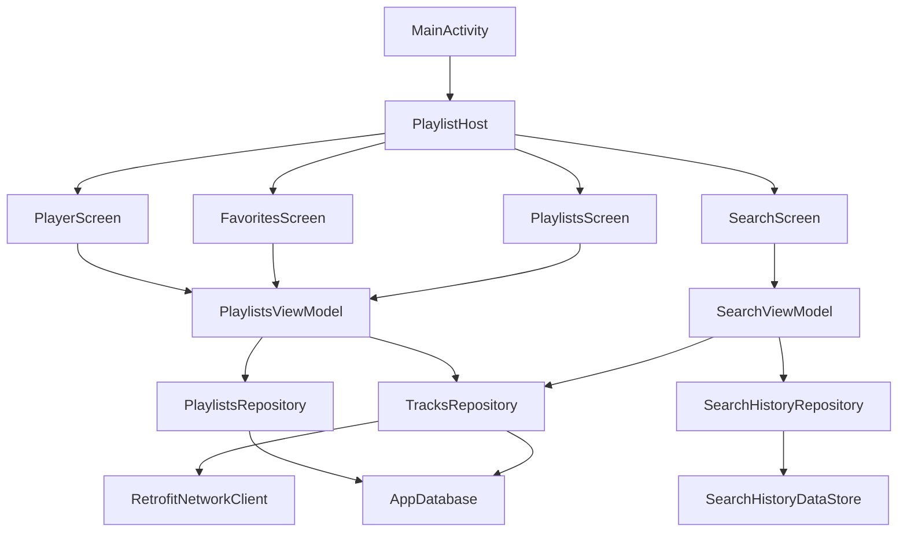

# PROJECT DEFENSE CHEATSHEET

## 1) Что это за проект
- `PlaylistMaker` — Android-приложение на Kotlin + Jetpack Compose для поиска треков через iTunes API, управления избранным и плейлистами.
- Архитектура близка к MVVM с разделением по папкам `ui`, `domain`, `data`.
- Хранение данных:
  - история поиска: `DataStore`,
  - плейлисты/избранное/связи трек-плейлист: `Room`,
  - обложки плейлистов: internal storage,
  - поиск треков: `Retrofit` (сеть).

## 2) Быстрая архитектурная карта

## 3) Где точка входа и навигация
- Точка входа: [`MainActivity.kt`](app/src/main/java/com/practicum/playlistmaker/ui/activity/MainActivity.kt)
- Граф навигации: [`PlaylistHost.kt`](app/src/main/java/com/practicum/playlistmaker/ui/navigation/PlaylistHost.kt)
- Маршруты:
  - `main_menu`
  - `search`
  - `settings`
  - `playlists`
  - `favorites`
  - `create_playlist`
  - `playlist_screen/{playlistId}`
  - `player`

## 4) Главные пользовательские сценарии
- **Поиск треков**: `SearchScreen -> SearchViewModel -> TracksRepository.searchTracks() -> Retrofit`.
- **История запросов**: `SearchViewModel -> SearchHistoryRepository -> SearchHistoryPreferences -> DataStore`.
- **Создание плейлиста**: `CreatePlaylistScreen -> PlaylistsViewModel -> PlaylistsRepository -> Room`.
- **Добавление трека в плейлист**: `PlayerScreen -> PlaylistsViewModel.insertTrackToPlaylist() -> TrackRepositoryImpl -> TrackDao + PlaylistTrackDao`.
- **Избранное**: `Player/Favorites -> toggleFavorite() -> TrackRepositoryImpl.updateTrackFavoriteStatus() -> TrackDao`.

## 5) Что где искать (самый нужный путеводитель)

### UI и ViewModel
- [`SearchScreen.kt`](app/src/main/java/com/practicum/playlistmaker/ui/search/SearchScreen.kt)
- [`SearchViewModel.kt`](app/src/main/java/com/practicum/playlistmaker/ui/search/SearchViewModel.kt)
- [`PlaylistsScreen.kt`](app/src/main/java/com/practicum/playlistmaker/ui/playlist/PlaylistsScreen.kt)
- [`PlaylistsViewModel.kt`](app/src/main/java/com/practicum/playlistmaker/ui/playlist/PlaylistsViewModel.kt)
- [`CreatePlaylistScreen.kt`](app/src/main/java/com/practicum/playlistmaker/ui/playlist/CreatePlaylistScreen.kt)
- [`PlaylistScreen.kt`](app/src/main/java/com/practicum/playlistmaker/ui/playlist/PlaylistScreen.kt)
- [`PlaylistViewModel.kt`](app/src/main/java/com/practicum/playlistmaker/ui/playlist/PlaylistViewModel.kt)
- [`PlayerScreen.kt`](app/src/main/java/com/practicum/playlistmaker/ui/player/PlayerScreen.kt)
- [`FavoritesScreen.kt`](app/src/main/java/com/practicum/playlistmaker/ui/favorites/FavoritesScreen.kt)
- [`SettingsScreen.kt`](app/src/main/java/com/practicum/playlistmaker/ui/settings/SettingsScreen.kt)

### Data layer
- [`TrackRepositoryImpl.kt`](app/src/main/java/com/practicum/playlistmaker/data/network/TrackRepositoryImpl.kt)
- [`PlaylistsRepositoryImpl.kt`](app/src/main/java/com/practicum/playlistmaker/data/network/PlaylistsRepositoryImpl.kt)
- [`SearchHistoryRepositoryImpl.kt`](app/src/main/java/com/practicum/playlistmaker/data/network/SearchHistoryRepositoryImpl.kt)
- [`RetrofitNetworkClient.kt`](app/src/main/java/com/practicum/playlistmaker/data/network/RetrofitNetworkClient.kt)
- [`ITunesApiService.kt`](app/src/main/java/com/practicum/playlistmaker/data/network/ITunesApiService.kt)
- [`AppDatabase.kt`](app/src/main/java/com/practicum/playlistmaker/data/db/AppDatabase.kt)
- [`TrackDao.kt`](app/src/main/java/com/practicum/playlistmaker/data/db/dao/TrackDao.kt)
- [`PlaylistDao.kt`](app/src/main/java/com/practicum/playlistmaker/data/db/dao/PlaylistDao.kt)
- [`PlaylistTrackDao.kt`](app/src/main/java/com/practicum/playlistmaker/data/db/dao/PlaylistTrackDao.kt)
- [`SearchHistoryPreferences.kt`](app/src/main/java/com/practicum/playlistmaker/data/preferences/SearchHistoryPreferences.kt)
- [`StorageProvider.kt`](app/src/main/java/com/practicum/playlistmaker/data/storage/StorageProvider.kt)
- [`PlaylistCoverStorage.kt`](app/src/main/java/com/practicum/playlistmaker/data/storage/PlaylistCoverStorage.kt)

### DI / composition root
- [`Creator.kt`](app/src/main/java/com/practicum/playlistmaker/creator/Creator.kt)

### Контракты domain
- [`TrackRepository.kt`](app/src/main/java/com/practicum/playlistmaker/domain/api/TrackRepository.kt)
- [`PlaylistsRepository.kt`](app/src/main/java/com/practicum/playlistmaker/domain/api/PlaylistsRepository.kt)
- [`SearchHistoryRepository.kt`](app/src/main/java/com/practicum/playlistmaker/domain/api/SearchHistoryRepository.kt)

## 6) Частые вопросы на защите (короткие ответы)

1. **Какой паттерн архитектуры?**  
   MVVM (Compose + ViewModel + StateFlow), с разделением на `ui/domain/data`.

2. **Как внедряются зависимости?**  
   Ручной DI через `Creator` (service locator), без Hilt/Koin.

3. **Где хранится история поиска?**  
   В `DataStore Preferences` (`SearchHistoryPreferences`), ключ `search_history`, максимум 10 записей.

4. **Где хранится избранное и плейлисты?**  
   В `Room` (`AppDatabase`, таблицы `tracks`, `playlists`, `playlist_track_cross_ref`).

5. **Как трек добавляется в плейлист?**  
   В `TrackRepositoryImpl`: upsert трека в `tracks` + вставка связи в `playlist_track_cross_ref`.

6. **Как обрабатываются ошибки сети?**  
   В `RetrofitNetworkClient`: исключения переводятся в `BaseResponse` с `resultCode/errorMessage`; затем `TrackRepositoryImpl` бросает `IOException`.

7. **Есть ли отдельный PlayerViewModel?**  
   Нет, `PlayerScreen` использует `PlaylistsViewModel`.

8. **Как передается трек на экран плеера?**  
   Через `PlayerNavigationArgs.pendingTrack` (in-memory объект), а не через сериализованные nav args.

9. **Какой риск в БД-миграциях?**  
   Включен `fallbackToDestructiveMigration()`: при несовместимой миграции данные могут быть удалены.

10. **Какие основные библиотеки?**  
    Compose, Navigation Compose, Retrofit, Gson, Room, DataStore, Coil, Coroutines.

## 7) Стек и конфиг (откуда читать)
- Build-конфиг: [`app/build.gradle.kts`](app/build.gradle.kts)
- Версии библиотек: [`gradle/libs.versions.toml`](gradle/libs.versions.toml)
- Kotlin `2.0.21`, AGP `8.13.2`, JVM target `11`, minSdk `29`, target/compileSdk `36`.

## 8) Мини-скрипт ответа на защиту (60 секунд)
1. Приложение позволяет искать треки через iTunes API, сохранять историю запросов, отмечать избранное и управлять плейлистами.
2. UI написан на Compose, состояние держится во ViewModel через Flow/StateFlow.
3. Сеть реализована через Retrofit, локальные данные через Room, история поиска через DataStore.
4. Навигация централизована в `PlaylistHost`, зависимости собираются вручную в `Creator`.
5. Основные риски: in-memory передача трека в player и destructive fallback для миграций Room.

## 9) Что открыть первым делом, если задают неожиданный вопрос
1. `PlaylistHost.kt` (понять маршруты и связи экранов)
2. `SearchViewModel.kt` (поток поиска + ошибки)
3. `PlaylistsViewModel.kt` (операции избранного/плейлистов)
4. `TrackRepositoryImpl.kt` (ключевая бизнес-логика данных)
5. `AppDatabase.kt` + DAO (как устроено хранение)
6. `Creator.kt` (как собираются зависимости)
